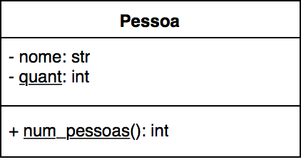
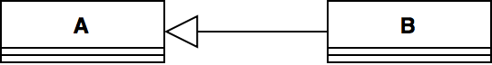
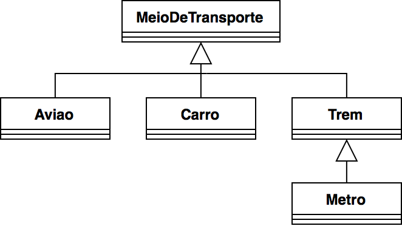

### Programação Orientada a Objetos
#### Atributos/Métodos de Classe e Herança
---

### Objetivo

Parte I - apresentar atributos e métodos de classe:

- Utilidade
- Sintaxe em Python

Parte II - apresentar o mecanismo de herança:

- O que é herança em POO
- Como utilizá-la na linguagem Python
---

### Parte I: Atributos e Métodos de Classe

- Frequentemente, é desejável ter atributos/métodos que são "globais",
  ou seja, não dizem respeito a uma única instância de uma classe
- Por exemplo:
  - Como podemos armazenar a quantidade de instâncias criadas de uma classe?
  - Observe que não faz sentido a quantidade de instâncias de uma classe
    ser atributo de cada objeto desta classe (como cada objeto pode armazenar
    esta informação?)
---

### Atributos e Métodos de Instância vs. Atributos e Métodos de Classe

- Até então, todos os atributos e métodos vistos são **de instância**
  - Dizem respeito a uma instância/objeto específico daquela classe
  - São comumente chamados de atributos/métodos (a parte *de instância* é implícita)
- Atributos e métodos de classe dizem respeito à classe, e não
  a um objeto específico daquela classe
  - Também chamados de dados *static* ou *atributos estáticos* e *métodos estáticos*
  - Não precisam de uma instância da classe para serem utilizados
---

### Atributos e Métodos de Classe



Notação UML: texto sublinhado indica métodos e atributos estáticos (de classe)
---

### Atributos e Métodos de Classe

Como é em Python (mais detalhes no notebook):

```python
class A:

    _atributo_de_classe1 = ...
    _atributo_de_classe2 = ...
    
    def __init__(self, ...):
      self._atributo_de_instancia1 = ...
      self._atributo_de_instancia2 = ...
      self._atributo_de_instancia3 = ...

    def metodo_de_classe(): # não tem self
      ...

```
---

### Os Quatro Pilares de POO

- Abstração
- Encapsulamento
- **Herança**: _capacidade de uma classe herdar o comportamento definido por
  outra classe_
- Polimorfismo
--- 

### Parte II: Herança

- Mecanismo que permite a __reutilização de comportamento__ entre classes
  - Possibilita a reutilização de código entre classes diferentes
- Um novo tipo de _relacionamento_ entre classes
- Esta relação acontece entre objetos _genéricos_ e objetos _específicos_ 
---

### Herança



- Relação do tipo "_é um_": "um objeto B __é um objeto__ A"
- Classe B __herda__ o comportamento (atributos e métodos) da classe A
- A: classe base, classe mãe ou _superclasse_
- B: classe derivada, classe filha ou _subclasse_
- As superclasses devem oferecer comportamentos genéricos
- As subclasses devem oferecer comportamentos específicos
---

### Exemplos

Relações de herança entre classes:

- ```Pessoa``` e ```Aluno```: todo aluno (objeto específico) é uma pessoa
  (objeto genérico)
- ```MeioDeTransporte``` e ```Carro```: todo carro (objeto específico) é um meio de transporte
  (objeto genérico)
- ```Sensor``` e ```Sonar```: todo sonar (objeto específico) é um sensor
  (objeto genérico)
- ```Poligono``` e ```Triangulo```: todo triângulo (objeto específico) é um polígono
  (objeto genérico)
---

### Mais um exemplo

Diagrama de classe envolvendo heranças:


---

### Por que precisamos de Herança?

- As relações de herança definem uma __hierarquia de classes__ onde as subclasses
herdam as caracteríssticas da suas superiores
- Para definir um comportamento em comum para objetos de uma mesma hierarquia
  - O código da classe base é reutilizado em todas as subclasses
  - Qualquer alteração no código da classe base é propagado para todas as subclasses
---

### Por que precisamos de Herança?

- O comportamento __comum__ a varias classes pode ser definido em uma superclasse
- As subclasses estendem (ou refinam) tal comportamento
---

### Herança em Python

```python
# Classe A: classe base
class A:
    pass

# Classe B: classe derivada
class B(A):
    pass
```

- A classe base é indicada entre parênteses em cada classe derivada
- Todos os atributos e métodos da classe base estão nas classes derivadas
---

### Reescrita de Métodos

- As subclasses herdam os atributos e métodos das superclasses 
- Entretanto, as subclasses podem _reescrever_ os métodos da superclasse para definir um
  comportamento mais específico
---

### Reescrita de Métodos

```python
class Pessoa:
  def __init__(self, nome, snome, dn):
    self._nome = nome
    self._snome = snome
    self._dn = dn

  def idade():
    ...

  def assinar(self):
    print(f'{self._nome} {self._snome}')
...
```
---

### Reescrita de Métodos

- Um médico é uma pessoa (com todos seus atributos e métodos)
- Além dos atributos da pessoa, o médico dever ter um CRM
- Os médicos assinam de forma diferente, com o sufixo _Dr(a)_

```python
class Medico(Pessoa):
  def __init__(self, nome, snome, dn, crm):
    #Inicializar a superclasse
    # super(): referência à superclasse
    super().__init__(nome, snome,dn) 
    self._crm = crm

  #reescrever o método assinar
  def assinar(self):
    print(f'Dr(a). {self._nome} {self._snome}')

...
```
---

### Mais exemplos
[08-heranca](08-Heranca.ipynb)
---